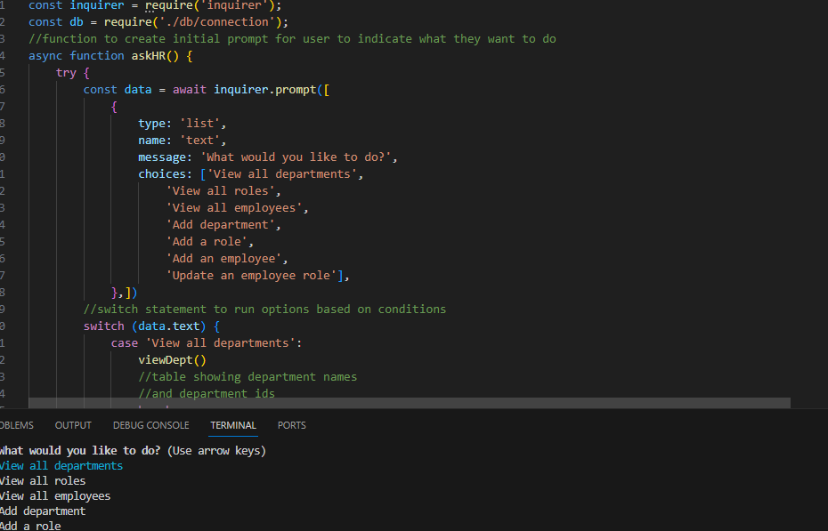

# Employee-Tracker

## Description
This program was designed to allow users to interact with a content management system containing a company employee database. The application uses Inquirer and SQL to prompt the user and query the database for information. The project demonstrated the use of node to create a program written in Javascript. 

The acceptance criteria were as follows: 

## Acceptance Criteria
```
GIVEN a command-line application that accepts user input
WHEN I start the application
THEN I am presented with the following options: view all departments, view all roles, view all employees, add a department, add a role, add an employee, and update an employee role
WHEN I choose to view all departments
THEN I am presented with a formatted table showing department names and department ids
WHEN I choose to view all roles
THEN I am presented with the job title, role id, the department that role belongs to, and the salary for that role
WHEN I choose to view all employees
THEN I am presented with a formatted table showing employee data, including employee ids, first names, last names, job titles, departments, salaries, and managers that the employees report to
WHEN I choose to add a department
THEN I am prompted to enter the name of the department and that department is added to the database
WHEN I choose to add a role
THEN I am prompted to enter the name, salary, and department for the role and that role is added to the database
WHEN I choose to add an employee
THEN I am prompted to enter the employee’s first name, last name, role, and manager, and that employee is added to the database
WHEN I choose to update an employee role
THEN I am prompted to select an employee to update and their new role and this information is updated in the database 
As the image illustrates, your schema should contain the following three tables:
```

This challenge utilized the node environment to create a program using dynamic Javascript. There were helpful error messages in the terminal to direct progress. The MySQL documentation was referenced throughout the project. I organized files by category. There were however, quite a few hurdles when building the queries. The first related to scope. There are nested functions that do not respond as expected depending on where they reside in relation to one another.  Furthermore, I realized how important it is to know the components of SQL (connectors, imports, and the like) to make the application workable. With practice, this should be become second nature. The recurring issue of needing to organize code so that it can be read and debugged is vitally important. Previous eureka moments were just as valuable here - reformatting code, implementing clear naming convention, and notating often.  I am still working to make this a natural part of the build process. 

## Usage

The js file can be used to understand the dynamic code that supports the application. A link to the mockup is listed below, for your convenience. 

## License

MIT License
Copyright (c) [2023] [Amber Watson]

Permission is hereby granted, free of charge, to any person obtaining a copy of this software and associated documentation files (the "Software"), to deal in the Software without restriction, including without limitation the rights to use, copy, modify, merge, publish, distribute, sublicense, and/or sell copies of the Software, and to permit persons to whom the Software is furnished to do so, subject to the following conditions:

The above copyright notice and this permission notice shall be included in all copies or substantial portions of the Software.

THE SOFTWARE IS PROVIDED "AS IS", WITHOUT WARRANTY OF ANY KIND, EXPRESS OR IMPLIED, INCLUDING BUT NOT LIMITED TO THE WARRANTIES OF MERCHANTABILITY, FITNESS FOR A PARTICULAR PURPOSE AND NONINFRINGEMENT. IN NO EVENT SHALL THE AUTHORS OR COPYRIGHT HOLDERS BE LIABLE FOR ANY CLAIM, DAMAGES OR OTHER LIABILITY, WHETHER IN AN ACTION OF CONTRACT, TORT OR OTHERWISE, ARISING FROM, OUT OF OR IN CONNECTION WITH THE SOFTWARE OR THE USE OR OTHER DEALINGS IN THE SOFTWARE.
The application should have a db.json file on the back end that will be used to store and retrieve notes using the fs module.

